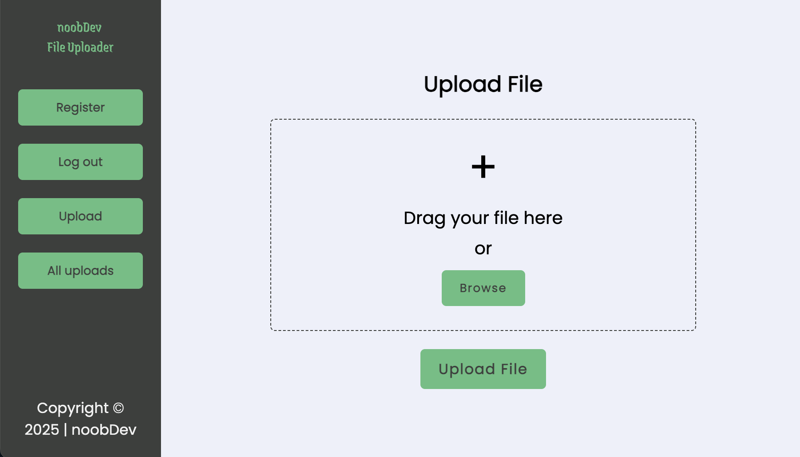

# noobDev File Uploader

## Technologies used

- **TypeScript** – Ensures type safety and enhances code maintainability.  
- **Vite** – A fast development build tool for optimized performance.  
- **Unelma Cloud** – Provides cloud storage for file uploads.  
- **React** – For building a responsive and dynamic UI.  
- **CSS** – For modern styling and layout flexibility.  
- **Axios** – For handling API requests efficiently.  

## Setup and usage

Live page [here]()

## Screenshot

## Sources 

- [GitHub Link - noobDev File Uploader ](https://github.com/mehedimrm22/unelma-cloud-clone)

